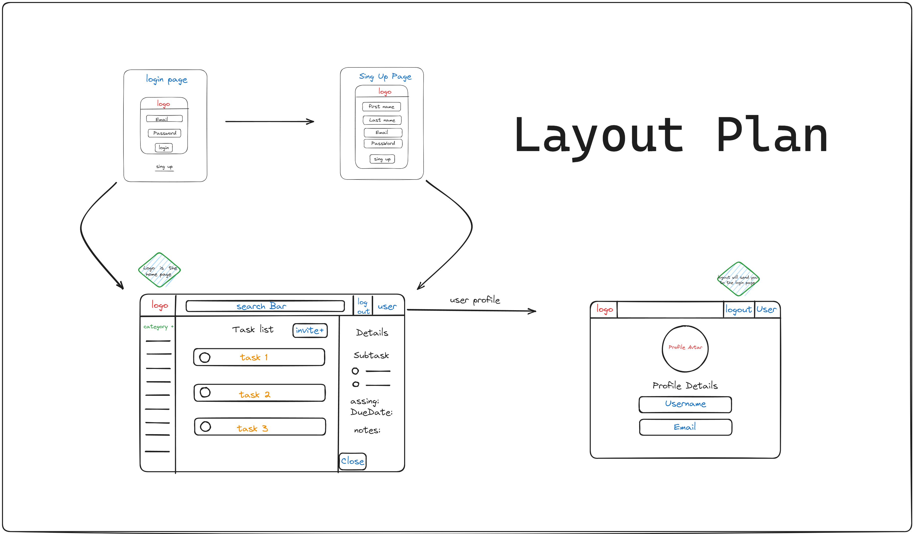
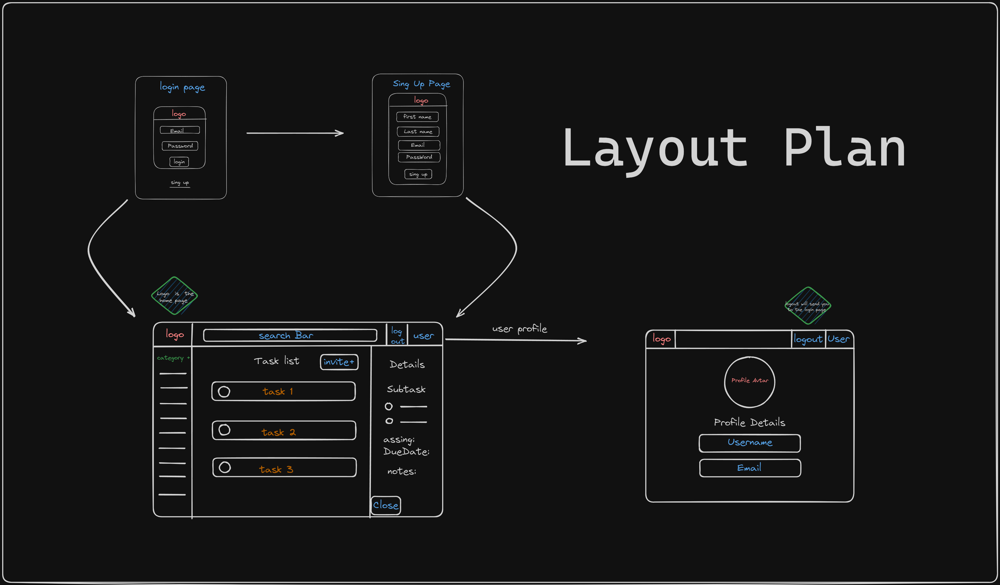

Lest Go
# Team Task Manager App: A Paragon of Efficiency

Our team is excited to present a pinnacle of productivity tools: a robust, intuitive, and efficient Task Manager application. This state-of-the-art tool is constructed using the power of Express Node.js and the flexibility of React, drawing inspiration from renowned project management platforms such as Trello.

## App Overview: Streamlining Success

Our Task Manager application redefines team collaboration and efficiency. It is designed to elegantly manage tasks within a team, fostering a harmonious balance of workload and productivity.

Admins are gifted full control over task management, capable of creating, assigning, editing, and deleting tasks for all users. This, in turn, empowers them to effectively manage their team's workload and delegate responsibilities with surgical precision.

Users can seamlessly view their tasks, mark them as complete, and add insightful notes or comments. This promotes a vibrant, collaborative environment where ideas flow freely and tasks are completed efficiently.

In addition, admins can monitor the progress of tasks and set ambitious yet achievable deadlines, ensuring projects are completed in a timely manner and fostering a culture of success.

## App Visuals: A Picture is Worth a Thousand Words

To provide a glimpse into the elegance of our application's design and user interface, we have captured some screenshots and wireframes:

## Wireframes: Blueprint of Brilliance

Our wireframes are the architectural blueprint of our application. They provide a visual guide to the application's structure, layout, and information flow. Here's a peek into the planned design:

## User Stories: Building Blocks of Functionality

User stories serve as the building blocks of our application. They are the voice of our end-users, guiding the functionalities and features we incorporate.

### Admin User Stories

- **Task Management**: As an admin, I yearn to create, edit, and delete tasks for all users, allowing me to orchestrate the team’s workload effectively.
- **Delegate Responsibilities**: As an admin, I wish to assign tasks to specific users, empowering me to delegate responsibilities judiciously.
- **Monitor Progress**: As an admin, I aspire to view the progress of all tasks, enabling me to monitor the team's productivity and drive success.
- **Set Deadlines**: As an admin, I aim to set deadlines for tasks, ensuring timely completion of projects and fostering a culture of efficiency.
- **Communication**: As an admin, I seek to add, edit, and delete notes and comments, facilitating clear communication and idea exchange within the team.

### User Stories

- **Task Management**: As a user, I strive to add and edit my tasks, helping me stay focused and organized.
- **View Assigned Tasks**: As a user, I desire to view my assigned tasks, enabling me to manage my responsibilities effectively.
- **Track Progress**: As a user, I wish to mark tasks as complete, allowing me to monitor my progress and celebrate small victories.
- **Communication**: As a user, I want to add notes and comments to tasks, promoting open and effective communication with my team.
- **View Deadlines**: As a user, I aim to view the deadlines for my tasks, helping me prioritize my workload and meet my goals.

## Entity Relationship Diagram (ERD): The Structured Symphony

Our Entity Relationship Diagram (ERD) represents the harmonious structure of our application's database. It illustrates how data is cohesively organized and how different entities interrelate.

## Technology Stack: The Cornerstones

Our application stands on the sturdy shoulders of leading-edge technologies:

- **Frontend**: React - A JavaScript library lauded for its prowess in building dynamic and responsive user interfaces.
- **Backend**: Express Node.js - A robust web application framework for Node.js, designed for crafting seamless web applications and APIs.
- **Database**: MongoDB - A versatile, document-oriented database program recognized for its scalability and flexibility.

## Future Enhancements: The Road Ahead

We are committed to continual improvement and innovation. Here are a few enhancements we envision for the future:

- **Notifications**: Users will be alerted when tasks are assigned or as deadlines approach, ensuring everyone stays informed and no tasks fall through the cracks.
- **Task Prioritization**: Users will be able to prioritize their tasks based on deadlines and importance, optimizing workflow and productivity.
- **Integration with Third-Party Tools**: We plan to integrate with leading collaboration tools like Slack and Google Calendar, promoting productivity and seamless scheduling.