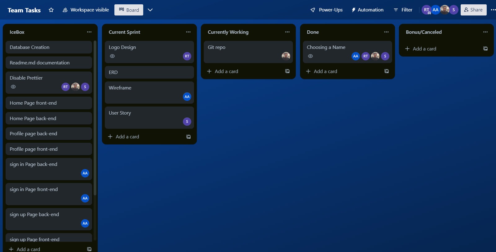
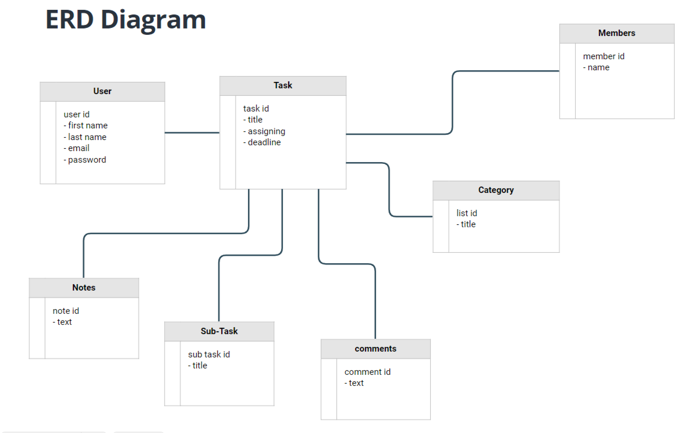

Done from trello (Team Task Manager)

Users Stories 

As an admin:

-I want to be able to create, edit, and delete tasks for all users so that I can manage the workload of my team.
-I want to be able to create, edit, and delete tasks for all users so .
-I want to be able to assign tasks to specific users so that I can delegate responsibilities.
-I want to be able to assign tasks to specific users so that I can delegate responsibilities.
-I want to be able to view the progress of all tasks so that I can monitor the productivity of my team.
-I want to be able to set deadlines for tasks so that I can ensure timely completion of projects.
-I want to be able to add, edit and delete notes and comments so that I can communicate and share my thoughts. 

As an admin, I want to be able to manage the users and the workload of my team by creating, editing, and deleting tasks for all users. I also want to be able to delegate responsibilities by assigning tasks to specific users. To monitor the productivity of my team, I want to be able to view the progress of all tasks. To ensure timely completion of the tasks, I want to be able to set deadlines for tasks. Additionally, I want to be able to communicate and share my thoughts by adding and deleting notes and comments.

As a user:

-I want to be able to add and edit my tasks so that I know what I need to work on. 
-I want to be able to view my assigned tasks so that I know what I need to work on.
-I want to be able to mark tasks as complete so that I can keep track of my progress.
-I want to be able to add notes and comments to tasks so that I can communicate with my team about the task.
-I want to be able to view the deadlines for my tasks so that I can prioritize my workload.

As a user, I want to be able to add and edit my tasks so that I know what I need to work on. I also want to be able to view my assigned tasks so that I can keep track of my responsibilities. To keep track of my progress, I want to be able to mark tasks as complete. Additionally, I want to be able to communicate with other members about the task by adding notes and comments. To prioritize my workload, I want to be able to view the deadlines for my tasks.
 main

ERD Diagram

